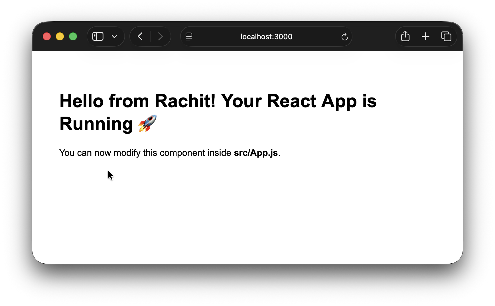

<h1> Simple React App </h1>

<h2> Table Of Content </h2>

- [1. Clone Repository](#1-clone-repository)
- [2. Run and Access the Simple React App](#2-run-and-access-the-simple-react-app)
- [3. App Launch Demo](#3-app-launch-demo)


## 1. Clone Repository

```bash
git clone https://github.com/RScrafted/simple-react-app.git --progress
cd simple-react-app.git
```

## 2. Run and Access the Simple React App

```bash
npm install
npm start
```

```
http://localhost:3000/
```

## 3. App Launch Demo

